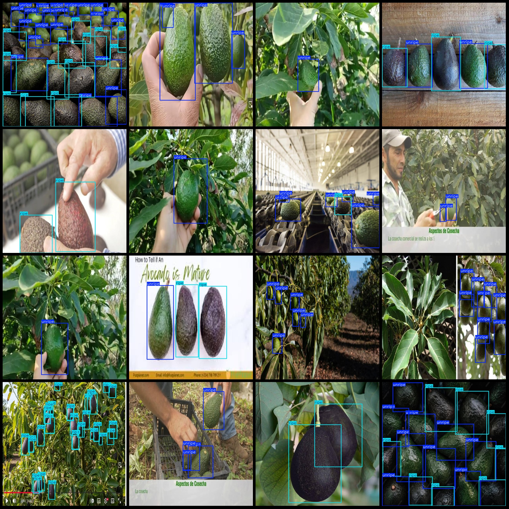
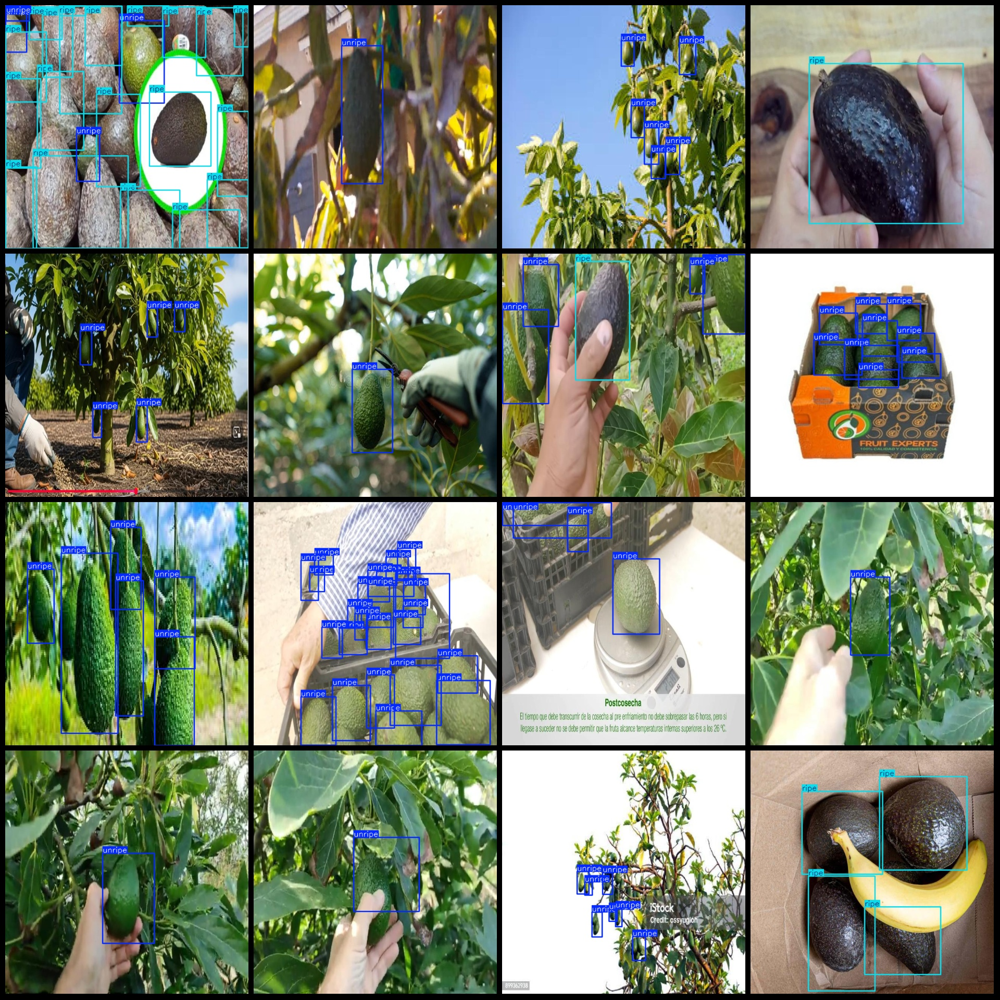

# Butternut Shell Maturity Detection Dataset (VOC+YOLO) - 753 images in 2 categories

Dataset format: Pascal VOC format + YOLO format (without split path in txtfile, only contain jpg image and corresponding VOC format xmlfile and yolo format txtfile)
number of images: 753  
annotation count: 753  
annotation count: 753  
annotationnumber of classes: 2  
Annotation class names (Note that the order of Yolo format classes does not correspond to this, but is based on the labels file with classes.txt): ["ripe", "unripe"]
boxes per class:   
ripe box count = 1914  
unripe box count = 3655  
total boxes: 5569  
image resolution: 640x640  
Use annotation tool: labelImg
Annotation rules: draw a rectangle around the class.
Important notes: dataset needs to be divided into training, validation, and test sets, which should be done by oneself.
Special statement: this dataset does not guarantee the accuracy of the trained model or weight file.
Image preview:
## Images

Here is a pay link on Stripe ( https://buy.stripe.com/3cs8yP7sY87d0vu9AB ). Please contact me lonlonago@foxmail.com after funding $89, and I will send you a complete data files , thank you!

